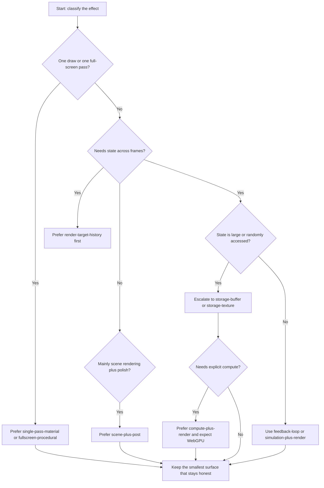

# Interface Decision Tree

Start by classifying the effect before choosing APIs.

## 1. Is the effect local to one draw or one full-screen pass?

If yes:

- prefer `single-pass-material` or `fullscreen-procedural`
- start with `uniforms`, `sampled-textures`, or `instanced-attributes`
- prefer `pure-tsl` unless a module clearly needs lower-level control

## 2. Does the effect need state that persists across frames?

If yes:

- use `render-target-history` first for image-like feedback and ping-pong workflows
- use `feedback-loop` or `simulation-plus-render` topology
- only escalate to `storage-buffer` or `storage-texture` when image-space history is not enough

## 3. Is the state structured, large, or randomly accessed?

If yes:

- prefer `storage-buffer`
- expect `webgpu-renderer`
- expect `raw-wgsl` or `tsl-plus-interop` if the task needs explicit GPU data control

Typical examples:

- boids
- cloth
- particle simulation
- skeletal or crowd data transforms

## 4. Is the state better expressed as images than records?

If yes:

- prefer `sampled-textures` or `render-target-history`
- choose `storage-texture` only when writable image resources are essential

Typical examples:

- fluid fields
- reaction diffusion
- blur and feedback chains
- procedural buffers consumed as textures

## 5. Does the task require an explicit compute stage?

If yes:

- prefer `compute-plus-render`
- expect `webgpu-renderer`
- prefer `raw-wgsl` unless the compute boundary stays small and well-supported

Typical examples:

- workgroup reductions
- neighbor queries over large particle sets
- simulation steps that do not map cleanly to render-target ping-pong

## 6. Is the task mainly scene rendering plus polish?

If yes:

- use `scene-plus-post`
- keep the base scene path correct before adding post
- prefer `pure-tsl` if the material and post logic stay readable

## Practical Rule

Choose the smallest interface surface that can express the effect without hiding essential constraints.

Do not jump to `WebGPU` storage or compute if `uniforms`, textures, or ping-pong render targets can solve the problem cleanly.
